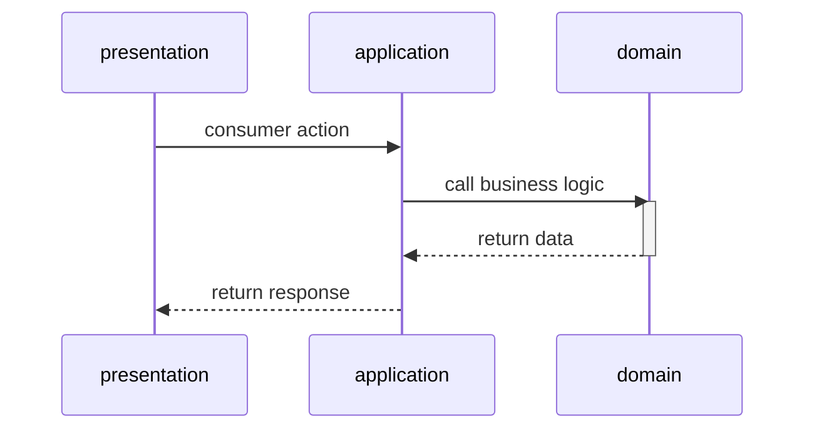

# B.F.F. (Back for front)

GitBook documentation :  [https://app.gitbook.com/o/pnEhpI29S43xX2hCVVtE/s/dAPGj3iELFyzrjbs0zuI/](https://app.gitbook.com/o/pnEhpI29S43xX2hCVVtE/s/dAPGj3iELFyzrjbs0zuI/)

## Spring initializer

This project was created with the [Spring initializer](https://start.spring.io/).

## Kotlin

We decided to use Kotlin language for this project.

Official Kotlin website is [kotlinlang.org](https://kotlinlang.org/).

To learn Kotlin try this playground [play.kotlinlang.org](https://play.kotlinlang.org/).

## Spring Boot

Spring Boot is a Java-based framework for building Spring-based applications.

More information about Spring Boot can be found on [spring.io](https://spring.io/).

## Onion Architecture

This project is built with the Onion Architecture pattern.

## Maven

We use Maven for building this project and manage packaging, dependencies and so on.
